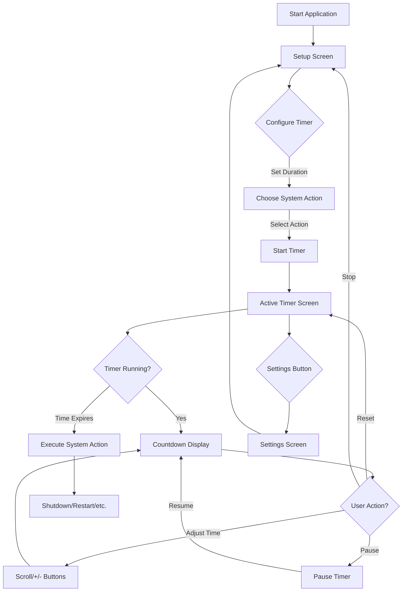
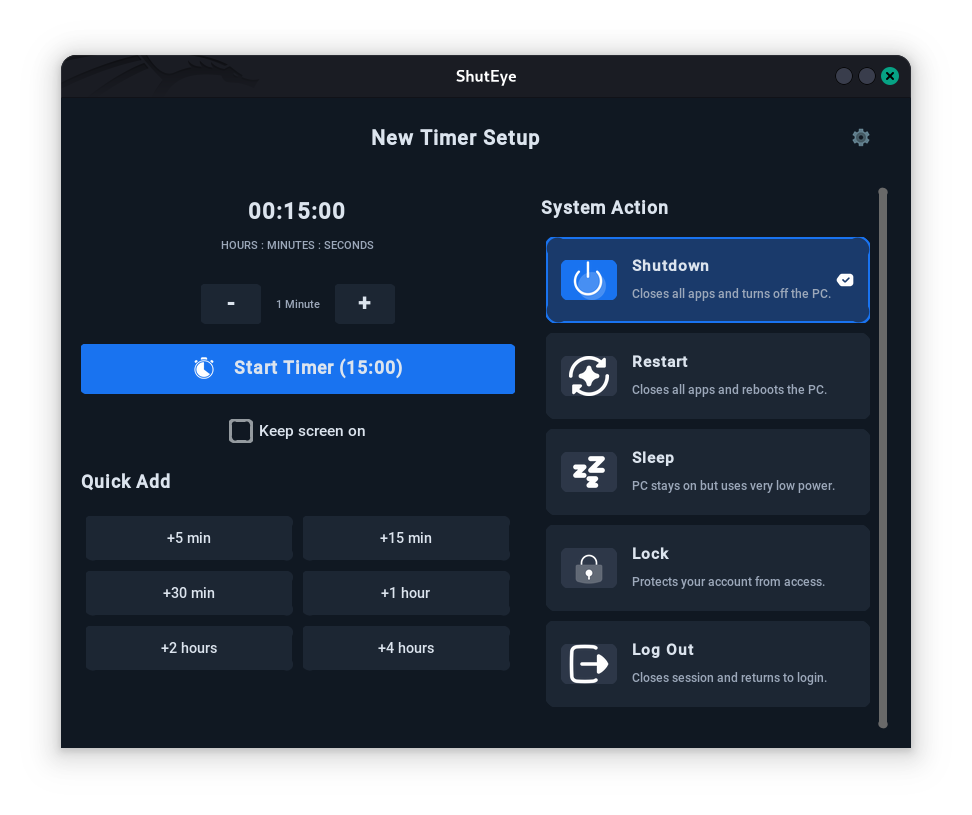
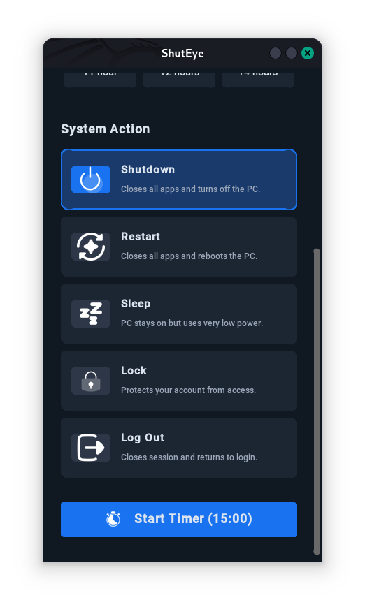
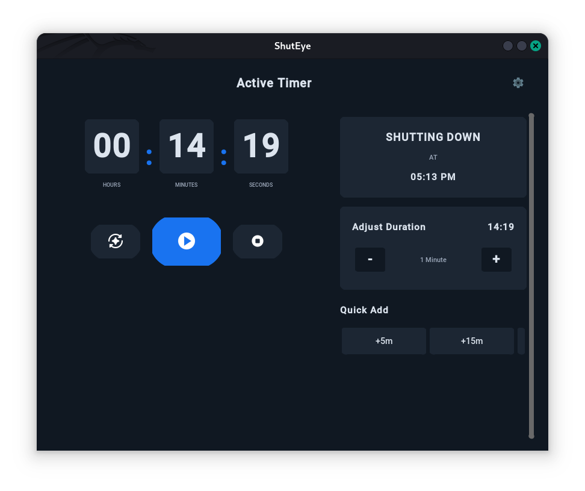

# ShutEye - System Timer

<div align="center">


**Schedule system actions with an elegant timer interface**

[](https://www.python.org/downloads/)
[](LICENSE)
[](https://github.com/TomSchimansky/CustomTkinter)

</div>

---

## Table of Contents

- [Overview](#overview)
- [Installation](#installation)
- [Usage](#usage)
- [Features](#features)
- [Workflow](#workflow)
- [Screenshots](#screenshots)
- [Contributing](#contributing)
- [License](#license)

---

## Overview

ShutEye is a desktop timer application that allows users to schedule system actions (shutdown, restart, lock screen, etc.) with an intuitive and elegant interface. The app runs in the system tray and provides visual countdown feedback with the ability to adjust timing on the fly.

### Target Users

- Users who want to automate system power management
- People who fall asleep while watching media and want auto-shutdown
- Users managing work/break intervals who want automatic screen locking
- Anyone needing scheduled system actions without using command-line tools

### Technology Stack

- **Python 3.8+**
- **CustomTkinter** - GUI framework
- **Pystray** - System tray functionality
- **Platform-specific APIs** - System actions (Windows, macOS, Linux)

---

## Installation

### Prerequisites

- Python 3.8 or higher
- pip (Python package installer)

### Steps

1. **Clone or download the repository**
   ```bash
   git clone https://github.com/namz182/ShutEye.git
   cd ShutEye
   ```

2. **Create and activate virtual environment** (recommended)
   ```bash
   python -m venv .env
   
   # Linux/Mac
   source .env/bin/activate
   
   # Windows
   .env\Scripts\activate
   ```

3. **Install dependencies**
   ```bash
   pip install -r requirements.txt
   ```

### Dependencies

- `customtkinter` - GUI framework
- `pystray` - System tray integration
- `Pillow` - Image processing for icons

---

## Usage

### Running the Application

```bash
python main.py
```

## Features

### Core Features

- **Timer Setup** - Configure timer duration using quick add buttons
- **Multiple System Actions** - Shutdown, Restart, Sleep, Lock Screen, Log Out
- **Live Timer Adjustment** - Modify duration while timer is running using scroll wheel or +/- buttons
- **Intuitive Controls** - Play/Pause, Reset, and Stop buttons with icons
- **Tray Integration** - Run in background with quick access from tray
- **Dark Theme** - Beautiful, customizable interface
- **Configuration** - Customize via JSON config file (no code changes needed)
---

## Workflow

### Application Flow Diagram





### State Diagram

```
┌──────────┐
│  IDLE    │ ←──────────────────────┐
└────┬─────┘                        │
     │                              │
     │ Start Timer                  │ Stop/Cancel
     ↓                              │
┌──────────┐                        │
│ RUNNING  │ ──── Timer Expires ────┤
└────┬─────┘                        │
     │                              │
     │ Pause                        │
     ↓                              │
┌──────────┐                        │
│ PAUSED   │ ────────────────────────┘
└──────────┘
     │
     │ Resume
     ↓
   (RUNNING)
```

---


### Basic Workflow

1. **Set Timer Duration**
   - Use quick add buttons (+5 min, +15 min, +30 min, etc.)
   - Or use the +/- buttons to adjust by 1-minute increments

2. **Choose System Action**
   - Click on desired action card (Shutdown, Restart, Sleep, Lock, Log Out)
   - Selected action is highlighted with a blue border

3. **Start Timer**
   - Click the " Start Timer" button
   - Timer begins countdown immediately

4. **Monitor/Adjust Timer**
   - View real-time countdown in Hours:Minutes:Seconds
   - Use scroll wheel on adjustment area to modify time
   - Use +/- buttons for precise 1-minute adjustments
   - Pause/Resume with play button
   - Reset to original duration
   - Stop to cancel and return to setup

5. **System Action Execution**
   - When timer reaches 0, selected system action executes automatically
   - System will shutdown/restart/lock/etc. as configured

---

## 📁 Project Structure

```
ShutEye/
│
├── main.py                      # Application entry point & main logic
├── config.json                  # Configuration file (customizable)
├── requirements.txt             # Python dependencies
│
├── assets/                      # Static assets
│   ├── icons/                   # UI icons (PNG format)
│   │   ├── check-fill.png      # Checkmark for selections
│   │   ├── lock.png            # Lock screen icon
│   │   ├── logout.png          # Log out icon
│   │   ├── moon-sleep.png      # Sleep mode icon
│   │   ├── navigate-back.png   # Back button icon
│   │   ├── play.png            # Play/resume icon
│   │   ├── power.png           # Shutdown icon
│   │   ├── redo.png            # Restart/reset icon
│   │   ├── settings.png        # Settings icon
│   │   ├── stop.png            # Stop button icon
│   │   └── stopwatch.png       # Timer/start icon
│   └── img/                    # Images
│       └── clock-logo.png      # Application logo
│
├── src/                        # Source code
│   ├── __init__.py
│   ├── config.py               # Configuration manager
│   ├── constants.py            # Application constants & paths
│   ├── tray.py                 # System tray integration
│   │
│   ├── ui/                     # User interface
│   │   ├── __init__.py
│   │   ├── components.py       # Reusable UI components
│   │   │                       # - CTkHeader (with icon buttons)
│   │   │                       # - CTkCard, CTkActionCard
│   │   │                       # - CTkQuickButton
│   │   │                       # - CTkTimerDisplay
│   │   │                       # - CTkIconButton
│   │   │                       # - CTkScrollableSection
│   │   │                       # - CTkLabel
│   │   └── screens.py          # Screen implementations
│   │                           # - SetupScreen
│   │                           # - ActiveScreen (with scroll adjustment)
│   │                           # - SettingsScreen
│   │
│   └── utils/                  # Utility modules
│       ├── __init__.py
│       ├── time_utils.py       # Time formatting & manipulation
│       └── system_actions.py   # System command execution
│
├── BUILD.md                    # Build instructions
├── PRD.md                      # Product requirements document
├── QUICKSTART.md               # Quick start guide
├── STRUCTURE.md                # Detailed structure documentation
└── README.md                   # This file

```

### Key Components

#### `main.py`
- Main application logic
- Timer state management
- Screen transitions
- Event handlers

#### `src/config.py`
- Loads and manages `config.json`
- Provides configuration access methods
- Theme color management

#### `src/constants.py`
- File paths and directory constants
- Icon path mappings
- Action-to-icon mappings

#### `src/tray.py`
- System tray icon and menu
- Background operation
- Quick actions from tray

#### `src/ui/components.py`
- **CTkHeader** - Header with back/settings icon buttons
- **CTkActionCard** - Action selection cards with icons
- **CTkTimerDisplay** - Hours:Minutes:Seconds display
- **CTkQuickButton** - Styled quick action buttons
- Other reusable UI widgets

#### `src/ui/screens.py`
- **SetupScreen** - Timer configuration with stopwatch start icon
- **ActiveScreen** - Running timer with scrollable adjustment (no slider)
- **SettingsScreen** - App info and developer details

#### `src/utils/`
- **time_utils.py** - Format time, convert seconds to H:M:S
- **system_actions.py** - Execute system commands (shutdown, restart, etc.)

---

## Configuration

### `config.json` Structure

```json
{
  "app": {
    "name": "ShutEye",
    "version": "21.01.26",
    "description": "Schedule system actions with an elegant timer interface"
  },
  
  "developer": {
    "name": "Mainza Namangani",
    "website": "https://mainza-namangani.rf.gd"
  },
  
  "theme": {
    "primary_color": "#1973f0",
    "bg_dark": "#101822",
    "card_bg": "#1c2633"
  },
  
  "quick_times": [
    {"label": "+5 min", "seconds": 300},
    {"label": "+15 min", "seconds": 900},
    {"label": "+30 min", "seconds": 1800},
    {"label": "+1 hour", "seconds": 3600},
    {"label": "+2 hours", "seconds": 7200},
    {"label": "+4 hours", "seconds": 14400}
  ],
  
  "actions": [
    {
      "name": "Shutdown",
      "icon": "power.png",
      "description": "Turn off your computer"
    },
    {
      "name": "Restart",
      "icon": "redo.png",
      "description": "Restart your system"
    },
    {
      "name": "Sleep",
      "icon": "moon-sleep.png",
      "description": "Put your computer to sleep"
    },
    {
      "name": "Lock",
      "icon": "lock.png",
      "description": "Lock your screen"
    },
    {
      "name": "Log Out",
      "icon": "logout.png",
      "description": "Sign out of your session"
    }
  ]
}
```

### Customization

You can customize the app without touching the code:

- **App Name/Version** - Change branding
- **Theme Colors** - Modify UI colors
- **Quick Time Buttons** - Add/remove/change preset times
- **System Actions** - Enable/disable actions, change icons
- **Developer Info** - Update attribution

---

## 🖥️ System Actions

### Supported Actions
| Action | Description | Platform Support |
|--------|-------------|------------------|
| **Shutdown** | Turn off your computer | Windows, macOS, Linux |
| **Restart** | Restart your system | Windows, macOS, Linux |
| **Sleep** | Put computer to sleep | Windows, macOS, Linux |
| **Lock** | Lock your screen | Windows, macOS, Linux |
| **Log Out** | Sign out of session | Windows, macOS, Linux |


---
## Screenshots
<div align="center">

### Setup Screen
Configure timer duration and select system action with modern UI and icon-based navigation.



### Active Timer
Live countdown with time adjustment, play/pause controls, and action status.

</div>
---
##  Contributing

Contributions are welcome! Please follow these guidelines:

1. Fork the repository
2. Create a feature branch (`git checkout -b feature/AmazingFeature`)
3. Commit your changes (`git commit -m 'Add some AmazingFeature'`)
4. Push to the branch (`git push origin feature/AmazingFeature`)
5. Open a Pull Request

### Coding Standards

- Add docstrings to functions and classes
- Comment complex logic
- Test on multiple platforms when possible

---

## License

This project is licensed under the MIT License - see the LICENSE file for details.

---

<div align="center">

**Made with ❤️ by Mainza Namangani**

[https://mainza-namangani.rf.gd](https://mainza-namangani.rf.gd)


⭐ Star this repository if you find it helpful!

</div>